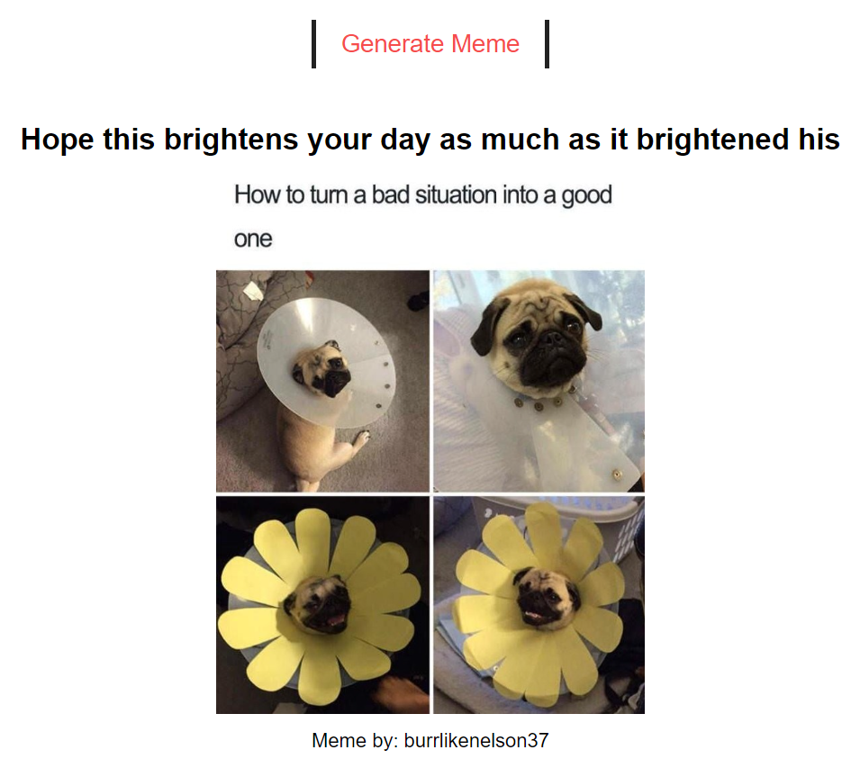

# Digital Clock

This is a simple web application built using HTML, CSS, and JavaScript that displays a random meme and its author when a button is clicked. It utilizes the Fetch API to retrieve the data from an external source.

## Usage

To use the application, simply open the `index.html` file in a web browser. Upon loading the page, you will see a button labeled "Generate Random Meme." Clicking this button will fetch a random meme and its author from the server and display them on the screen.

## Technologies Used

- HTML
- CSS
- JavaScript
- Fetch API
